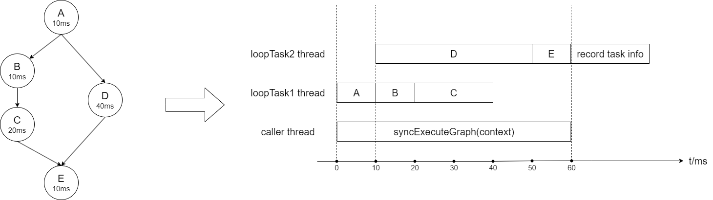

# 有向无环图执行引擎

有向无环图执行引擎将业务逻辑分解为多个子逻辑，每个子逻辑对应有向无环图的一个节点，子逻辑之间的依赖关系对应节点之间的有向边，执行一次业务逻辑对应执行一次图任务

执行引擎的核心为拓扑排序和多线程同步，支持最大化并行执行节点并尽可能减少线程切换次数

## 核心数据结构

### DagContext
每次执行图任务时创建一个DagContext，用于本次图任务在节点之间传递数据

每个节点从DagContext获取运行所需参数，运行后将结果保存到DagContext中来传递给后续节点

**graphName** 有向无环图名称，用于区分图，不可重复

**dagRecorder** 记录图任务执行时的各项数据，如节点耗时、异常节点

**stopped** 图任务终止状态，如果图任务被终止则跳过未执行且不要求强制执行的节点任务

**stopReason** 图任务被终止的原因

### Node
有向无环图节点，用于保存节点对应的业务逻辑相关信息

有向无环图的节点均为单例，被该有向无环图的所有图任务共享

**action** 具体的业务逻辑

**extraParam** 有向无环图配置文件中定义的扩展参数

**condition** 业务逻辑执行条件，如果满足则执行，否则跳过，默认满足

**timeout** 业务逻辑的超时时间，默认为0即不设置超时时间

**forced** 图任务被终止后是否强制执行，默认为false即不强制执行

**predecessorNodeList** 当前节点直接依赖的所有节点

**successorNodeList** 直接依赖当前节点的所有节点

### NodeTask
节点任务，用于执行节点保存的业务逻辑

每次执行图任务时，对该有向无环图的每个节点创建对应的节点任务，节点任务只属于本次图任务，在执行完图任务后销毁

**atomicPredecessorNum** 初始值为当前节点任务直接依赖的节点任务数量，每个直接依赖的节点任务在执行完成后对该值减一，减到零即代表当前节点任务可以执行

### LoopTask
循环任务，在执行图任务时各线程实际运行的逻辑

一个图任务会创建至少一个循环任务，一个循环任务至少执行一个节点任务

循环任务在创建时只传入一个节点任务，执行完该节点任务后，找出直接依赖该节点任务的节点任务集合，调整这些节点任务的依赖状态并选出可执行的节点任务，选择其中一个在当前线程直接执行，其余每个创建一个新的循环任务并提交给图线程池并行执行，循环上述流程直到没有可执行的节点任务为止

**firstNodeTask** 循环任务在创建时传入的节点任务

### TaskDispatcher
任务调度器，每次执行图任务时先创建一个任务调度器，任务调度器对有向无环图的每个入口节点创建循环任务并提交给有向无环图线程池并行执行来开启图任务

**exitNodeCountDownLatch** 初始值为有向无环图的出口节点数量，每个出口节点对应的节点任务完成后对该值减一，减到零即代表图任务执行完成

**recorded** 初始值为false，当图任务执行完成时，通过cas操作成功将该值修改为true的循环任务线程会记录本次图任务执行信息，避免多个循环任务线程重复记录

### Graph
有向无环图，一种业务逻辑对应一个有向无环图

有向无环图均为单例，被该有向无环图的所有图任务共享

**threadPoolExecutor** 一级线程池，用于执行循环任务

**secondThreadPoolExecutor** 二级线程池，对于设置了超时时间的节点任务，二级线程池用于执行节点任务具体逻辑，一级线程池只用于控制超时时间

**stageNum** 阶段数量，有向无环图可划分为一个或多个阶段，每个阶段包含至少一个节点且每个节点只属于一个阶段

**entryNodeList** 入口节点集合，即入度为零的节点

**exitNodeList** 出口节点集合，即出度为零的节点

**allNodeList** 全部节点集合

**requireAllNodesSuccess** 是否要求所有节点成功，如果有节点任务执行失败且该有向无环图要求所有节点成功，则立即终止图任务，默认为false即不要求

## 示例



## 如何使用

### 实现Action
Action接口用于执行业务逻辑，使用@NodeAction注解将其注册为Spring
Bean
* extractParam：从DagContext和ExtraParam中提取出业务逻辑入参
* process：根据extractParam方法构造的入参，执行业务逻辑，返回业务逻辑执行结果
* saveResult：将process方法返回的业务逻辑执行结果保存到DagContext
```java
@NodeAction
public class ExampleAction implements Action<CreateFirstListAction.Param, CreateFirstListAction.Result> {

    public static class Param {
        
    }
    
    public static class Result {
        
    }

    @Override
    public Param extractParam(DagContext context, ExtraParam extraParam) {
        
        return new Param();
    }

    @Override
    public Result process(Param param) {
        
        return new Result();
    }

    @Override
    public void saveResult(DagContext context, Result result) {
        
        context.setResult(result);
    }

}
```

### 实现Condition
Condition接口用于判断是否执行Action，使用@NodeCondition注解将Condition注册为Spring
Bean
* meet：根据DagContext进行判断，返回true则执行Action，返回false则跳过
```java
@NodeCondition
public class ExampleCondition implements Condition {
    @Override
    public boolean meet(DagContext dagContext) {
        
        return true;
    }
}
```

### 配置有向无环图
有向无环图的配置文件为json，格式如下：
```json5
{
    // 图名称
    "graphName": "demoGraph",
    // 一级线程池配置
    "threadPoolConfig": {
        //核心线程数
        "coreSize": 4,
        //最大线程数
        "maxSize": 8,
        //阻塞队列长度
        "queueSize": 512
    },
    // 任一节点任务抛出异常后是否终止图任务，默认为false，即不终止
    "requireAllNodesSuccess": true,
    // 二级线程池配置，如果所有节点都未设置超时时间，则忽略此项
    "secondThreadPoolConfig": {
        "coreSize": 2,
        "maxSize": 4,
        "queueSize": 256
    },
    // 有向无环图各阶段，key为阶段名称，value为阶段具体信息
    "stages": {
        "processList": {
            // 阶段名称
            "stageName": "processList",
            // 阶段描述信息，只用于注释
            "description": "",
            // 当前阶段所依赖的阶段名称集合
            "dependency": [],
            // 当前阶段的所有节点，key为节点名称，value为节点具体信息
            "nodes": {
                "createFirstList": {
                    // 节点名称
                    "nodeName": "createFirstList",
                    // 节点描述信息，只用于注释
                    "description": "",
                    // 节点对应Action的全路径名
                    "clz": "com.example.dag.business.action.CreateFirstListAction",
                    // 节点对应Condition的全路径名，默认为null，即不判断条件直接执行Action
                    "conditionClz": "com.example.dag.business.condition.RandomCondition",
                    // 当前节点直接依赖的同一阶段内节点名称集合
                    "dependency": [],
                    // 扩展参数，key为参数名，value为参数值，类型均为String，如果节点任务不需要扩展参数，则忽略此项
                    "extraParam": {
                        "size": "100000"
                    }
                },
                "createSecondList": {
                    "nodeName": "createSecondList",
                    "description": "",
                    "clz": "com.example.dag.business.action.CreateSecondListAction",
                    "dependency": [],
                    "extraParam": {
                        "origin": "100000000",
                        "bound": "1000000000000",
                        "size": "2000000"
                    },
                    // 节点任务超时时间，单位为毫秒，默认为0，即不限制超时时间
                    "timeout": 200
                },
                "mergeTwoList": {
                    "nodeName": "mergeTwoList",
                    "description": "",
                    "clz": "com.example.dag.business.action.MergeTwoListAction",
                    "dependency": [
                        "createFirstList",
                        "createSecondList"
                    ]
                }
            }
        },
        "printLog": {
            "stageName": "printLog",
            "description": "",
            "dependency": [
                "processList"
            ],
            "nodes": {
                "stop": {
                    "nodeName": "stop",
                    "description": "",
                    "clz": "com.example.dag.business.action.StopGraphAction",
                    "dependency": [],
                    "extraParam": {
                        "stopReason": "test"
                    }
                },
                "simple": {
                    "nodeName": "simple",
                    "description": "",
                    "clz": "com.example.dag.business.action.SimpleAction",
                    "dependency": [
                        "stop"
                    ]
                },
                "log": {
                    "nodeName": "log",
                    "description": "",
                    "clz": "com.example.dag.business.action.LogAction",
                    "dependency": [
                        "simple"
                    ],
                    // 图任务被终止后是否强制执行，默认为false，即不强制执行
                    // 此图中stop节点内部逻辑会终止图任务，终止之后simple节点被跳过，log节点仍会强制执行
                    "forced": true
                }
            }
        }
    }
}
```

### 加载有向无环图
SpringBoot应用启动时根据json配置加载有向无环图
```java
@Component
public class Initializer implements CommandLineRunner, ApplicationContextAware {

    private ApplicationContext applicationContext;

    @Override
    public void setApplicationContext(ApplicationContext applicationContext) throws BeansException {
        this.applicationContext = applicationContext;
    }

    @Override
    public void run(String... args) throws Exception {
        DirectedAcyclicGraphExecutorEngine.loadGraph("classpath*:dag/**", applicationContext);
    }

}
```

### 执行图任务
```java
// 构建图任务context
BusinessContext businessContext = new BusinessContext(graphName);

// 阻塞等待图任务完成
DirectedAcyclicGraphExecutorEngine.syncExecuteGraph(businessContext);

// 阻塞等待图任务固定时间
boolean finished = DirectedAcyclicGraphExecutorEngine.syncExecuteGraphWithTimeout(businessContext, timeout);

// 异步执行图任务
AsyncTaskResult asyncTaskResult = DirectedAcyclicGraphExecutorEngine.asyncExecuteGraph(businessContext);
boolean finished = asyncTaskResult.get(timeout);
```